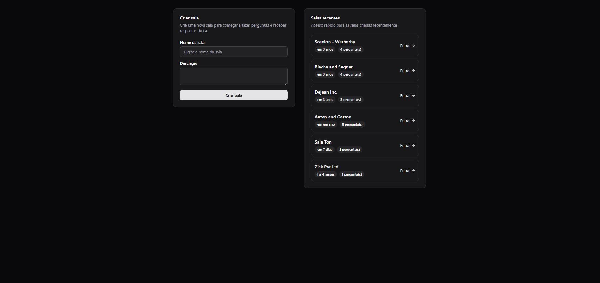
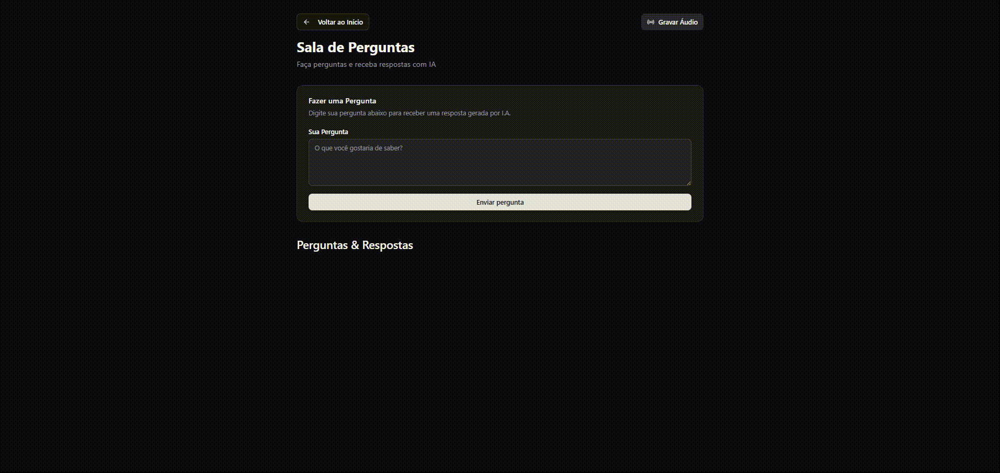

# Let me ask

Aplicação full-stack para a criação de salas de perguntas com interação por voz e inteligência artificial. O usuário pode gravar áudios diretamente pelo navegador, gerar embeddings desses áudios e, a partir deles, receber respostas inteligentes produzidas pela API Gemini.  
O projeto combina tecnologias modernas de front-end, back-end, banco de dados e IA para entregar uma experiência rápida, funcional e escalável.

---

## 🚀 Tecnologias Utilizadas

### **Back-end**
- **Node.js**
- **Fastify**
- **Drizzle ORM**
- **PostgreSQL**
- **Docker**

### **Front-end**
- **React**
- **Vite**
- **Tailwind CSS**
- **React Router DOM**
- **React Query**
- **Hooks customizados**

### **Inteligência Artificial**
Integração com a **API Gemini**, utilizada para:
- Transcrição de áudio
- Geração de embeddings
- Criação de respostas inteligentes baseadas no contexto armazenado

---

## 📌 Funcionalidades Principais

### ✔ Criar Sala
O usuário cria uma sala informando:
- Nome  
- Descrição  

Após isso, pode acessá-la pela interface.

### ✔ Acessar Sala
Cada sala possui uma página própria, onde o usuário interage com os áudios e a IA.

### ✔ Gravar Áudio no Navegador
- Botão para iniciar e finalizar gravação
- Upload automático do áudio
- Transcrição e geração de embeddings via IA
- Salvamento no banco de dados para uso como contexto

### ✔ Fazer Perguntas à IA
O usuário digita perguntas dentro da sala e recebe respostas geradas de forma inteligente, considerando:
- Áudios gravados na sala
- Embeddings armazenados no banco de dados  
- Histórico de contexto da própria sala

---

## 🧠 Como a IA Funciona

1. O usuário grava um áudio.
2. O áudio é transcrito e convertido em embeddings.
3. Os embeddings são salvos no PostgreSQL via Drizzle.
4. Quando uma pergunta é feita:
   - Os embeddings são buscados no banco
   - O contexto relevante é enviado ao Gemini
   - O Gemini gera uma resposta inteligente com base nos dados existentes

---

## 📦 Instalação e Execução

### **1. Clone o repositório**
```bash
git clone <link-do-repositorio>
cd nome_do_repositorio
```

### **2. Instalação e execução do Back-end**
```bash
cd server
docker-compose up -d
npm install
npm run dev
```

### **3. Instalação e execução do Front-end**
```bash
cd web
npm install
npm run dev
```




